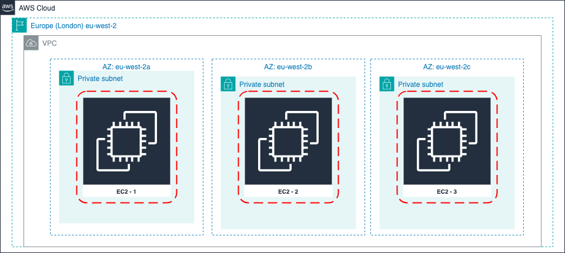

= AWS Global Infrastructure
:toc:

AWS global infrastructure and its components.

High availability, low latency, fault tolerant, flexible, robust, secure to deliver consistent user experience achieved by hosting the AWS services located close to customer physically.

Customers setting their own datacenters across the globe is expensive, so cost effective solution is pay-s-you-go service provided by AWS.

== Components of AWS Global Infra

=== Regions +

Represents global Area where infra is located in number of Datacenters that are logically grouped as AZs.

Region is cluster of data centers network.

=== Availability zones (AZ) (HA, Resilience) +

Each region has different AZs isolated physically far apart, each AZ is connected other AZ with in the region, This is to achieve the High Availability. +

Example architecture: To design igh Availability and Scalability, three EC2 instances are launched in a region will be deployed to three different AZs each to ensure HA and resilient. +
Data is replicated between AZs to avoid data loss in case of any EC2 instance is a AZ failed, other two instances in different AZs will be available.

=== Edge Locations (Minimum latency) +
This is to offer Content Delivery Network to distribute content to end users to ensure minimal latency. +

AWS services at Edge Locations:

* CloudFront
* Route 53
* AWS Firewall Manager
* AWS Shield
* AWS WAF

=== Local Zones
Host services like EC2, EBS, EKS, etc. in data centers that very close to customers to further minimize the latency for end users.

=== AWS Wavelength Zones
Deploy AWS services rapidly using 5G services to allow traffic from 5G devices with fewer network hops and less latency.

=== Architecture Diagram

.AWS Global Infrastructure
[]

