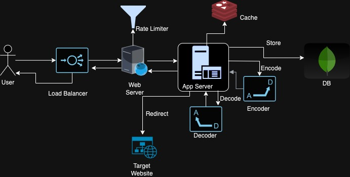

== Tiny URL Design
:page-background-image: image:DEAFT.png[opacity=50%]

Short Alias URL for long URLS.
Clicking on short URL redirects to long URL.

== Requirements

.Functional Requirements

* System should Generate short URL to users.
* System should Redirect user to original long URL upon clicking the short URL.
* System should Store the shortened URL mapping of short url to long URL.
* System should generate a unique Id sequence for each URL
* Store Frequently accessed URL requests to process efficiently
* Limit the number of request for DDoS.
* User can delete, update the generated short URL.
* Default expiration of URL and customization if required by user to extend expiration time.

. Non Functional Requirements

* Availability ZDT
* Fault Tolerant
* Scalability - Horizontal
* Readability - URL should be readable and easily type-able.
* Latency - Redirection time should be as less as possible.

== Estimation

How many short URLs generated per day? +
How long these short and long URLs stored per day? +
How much is each pair of url size is? +
How many requests are received per second? +
Total storage size required? +
Incoming data, Out going data bandwidth? +
Cache size? +

== Storage schema
Read Heavy, eventual consistent, non relational DB.
No SQL database is suitable as there is no structured schema required.

== High-level design
The four key building blocks required to design a system like TinyURL are:

.. Database: It is used to store the mapping between long URLs and the corresponding short URLs.

.. Sequencer: This provides unique IDs that serve as a starting point for each short URL generation.
.. Cache: Used to store the most frequent short URL-related requests to improve response times.
.. Rate limiters: These are implemented to avoid system exploitation and put a limit on the number of incoming requests to ensure fair usage.

These components work together to efficiently generate, store, and manage short URLs, ensuring the system is scalable, fast, and secure.

== APIs

== Detailed Design

== Evolution

== Distinctive Component.
