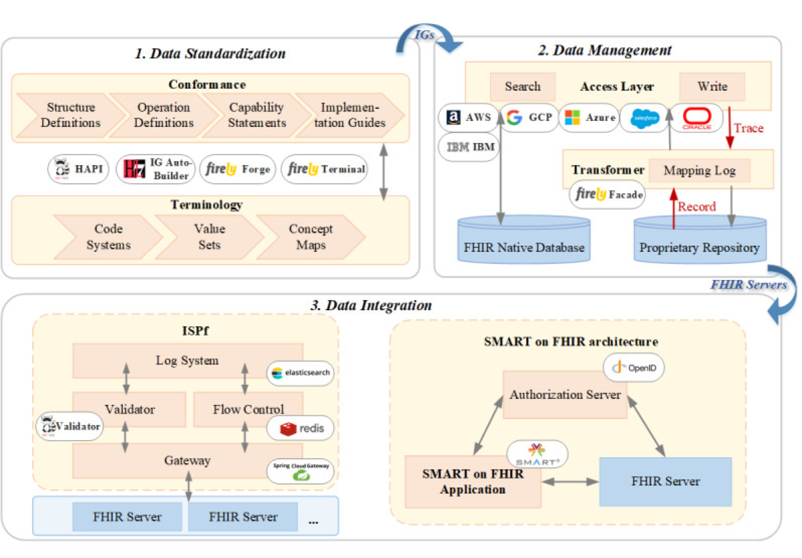
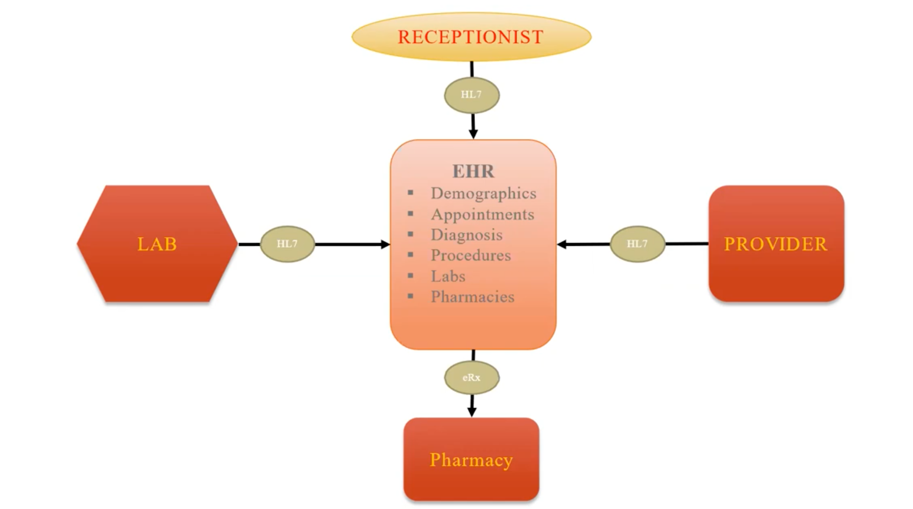
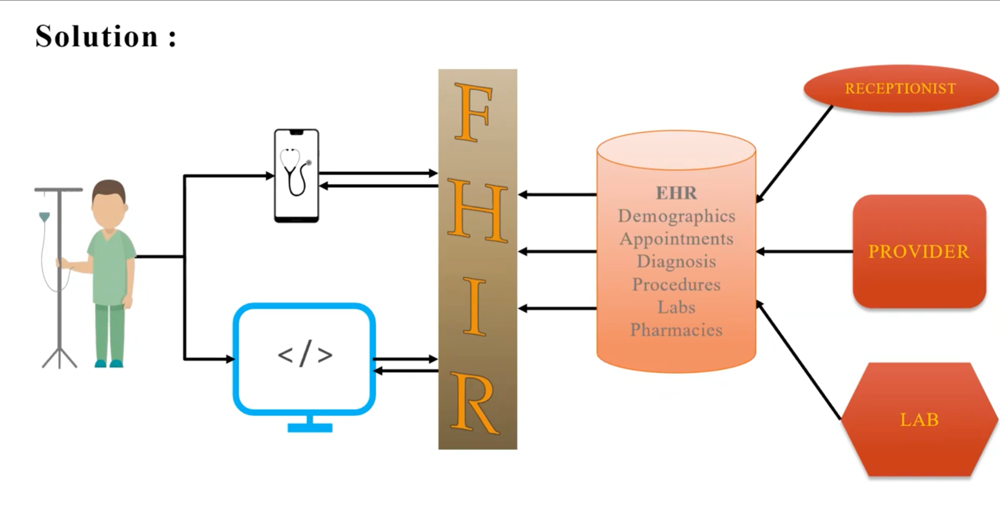

= FHIR

FHIR is a standard for health care data exchange, published by HL7®. +

FHIR is an interoperability standard intended to facilitate the exchange of healthcare information between healthcare providers, patients, caregivers, payers, researchers, and any one else involved in the healthcare ecosystem. It consists of 2 main parts – a content model in the form of ‘resources’, and a specification for the exchange of these resources in the form of real-time RESTful interfaces as well as messaging and Documents. +

The standard is available at http://hl7.org/fhir[fhir] +

https://fhir-drills.github.io/simple-patient.html

https://fire.ly/wp-content/uploads/2021/05/HL7-FHIR-R4-Cheat-Sheet.pdf

For a C-suite level overview see FHIR for the C-Suite.4Sep19.pdf +

https://smarthealthit.org/wp-content/uploads/SMART-on-FHIR-White-Paper-for-HIMSS-15-06Apr2015.pdf

.Patients
Patient Data +
Patient Care +
Public Health
Can be *Animal* also check: Extensions Patient-Animal +

.Healthcare Providers
Healthcare Providers

.Care Givers
Care Givers

.Researchers
Clinical Researchers

.Public

Reference: +
https://www.youtube.com/watch?v=qSP0XyF_PQM[Youtube] +
Contact: 9642373173

Fast Health Interoperability  Resources +

Its a Facade Layer between EHR where all the patient data like demographics, appointments, diagnosis, procedures, labs, and pharmacies.

== HL7 Standard
Health level 7 - Analogous to OSI layer 7 applications layer. +
HL 7 provides framework to facilitate this interoperability through standard messaging formats and protocols. +
HL7 FHIR enables medical organisations to exchange, store, integrate and retrieve the global health data across systems while ensuring security and interoperability +

== Why Standards (HL7)
* Sharing Medical
* Interoperability ->Apps Talk each other
* Greater Safety for Patient
* Quicker Insurance for Claims
* Quality Quality Quality

== TARGETS

* Clinical and Public Health Laboratories
* Immunization Registries
* Quality Reporting Agencies
* Standards Development Organizations (SDOs)
* Regulatory Agency
* Payors
* Pharmaceutical Vendors
* EHR, PHR Vendors
* Equipment Vendors
* Health Care IT Vendors
* Clinical Decision Support Systems Vendors
* Lab Vendors
* HIS Vendors
* Local and State Departments of Health
* Medical Imaging Service Providers
* Healthcare Institutions (hospitals, long term care, home care, mental health)

== Resources
Formats: JSON XML TURTLE PROTOBUF +

Normative FLAG *_{N}_*- may not see much issues its a maturity of the resource +
Cardinality 0..1 1..1 1..M M..1 M..M +
Patient Resource ->DomainResource ->Resource +
